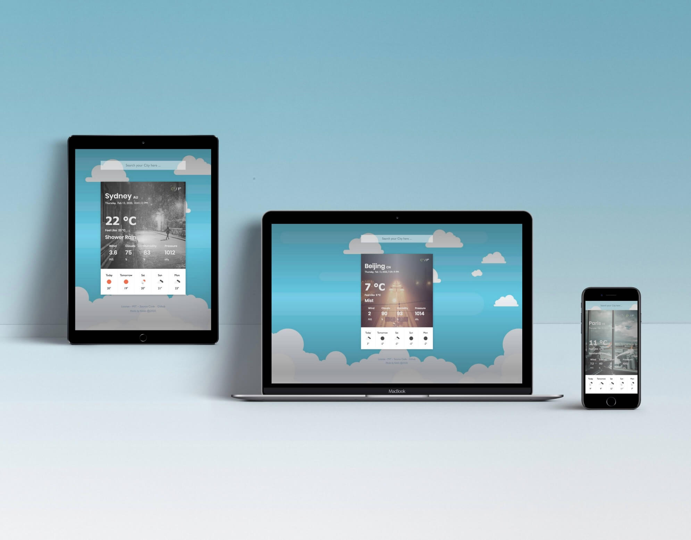

<h1 align="center"> <span> 🌤 </span>  Wether App Project</h1>

 <p align="center">
   
 
  <a href="https://github.com/kelvin8773/odin-weather-app/blob/master/LICENSE" target="_blank">
      
  </a>

   <a href="https://app.netlify.com/sites/my-weather-now/deploys" target="_blank">
      
  </a>
  
 </p>


> This is an [Odin Project Assignment](https://www.theodinproject.com/courses/javascript/lessons/weather-app) for mastering some key concepts in JavaScript - Such as Promise, Async/Await, API, JSON.




## 📣 Introduction

#### Key Concepts 
* Promise (then/catch)
* Async/Await
* Work with API (fetch/JSON)
* ES6 Module
* OOP (Object Oriented Programming)
* MVC (Model-View-Controller)
* Factory Function
 
#### Tech Stacks
* HTML5/CSS
* Bootstrap 4
* ESlint
* Webpack 4

#### Resources & Credit
* [OpenWeather API](https://openweathermap.org/) provide realtime weather Data;
* [unsplash.com](https://unsplash.com/) offer free and beautiful background image for various weather condition.
* [date-fns package](https://date-fns.org/) make datetime data more accessible for end User.
* [D3.js package](https://d3js.org/) give quickly load big csv data into memory feature;
* [Suggestion package](https://github.com/tristen/suggestions) give suggestion while inputting;
* [DataHub World Cities DataSet](https://datahub.io/core/world-cities) provide free world cities data-set;
* [Real Favicon Generator](https://realfavicongenerator.net/) help generate Favicon for this project.

## ✨ Live Demo ✨

* [Netlify Host](https://my-weather-now.netlify.com/);

## 🍩 Run Locally
Clone the project to your local machine and following following steps.

> To Clone Project Locally.
```bash
git clone git@github.com:kelvin8773/odin-weather-app.git
cd odin-to-do-list
```
> To install dependencies
```bash
npm install
```
> To build the project
```bash
npm build
```
> To Run Locally
```bash
npm start 
```
> Open http://127.0.0.1:8080 using your favorite browser, if it doesn't open automatically.

## ☕️ Development Mode 

After run the project locally, you can choose either **build once** or **continue build** to reflect changes from development.

> To build once
```bash
npm run dev
```
> To continue build
```bash
npm run watch
```

> Please Note - Once you are ready to deploy the project into production environment, you can run `npm build` to produce the production ready files (under `./dist` folder).

> And you do need to acquire your own API Keys (from above resources if needed) for development.


## 🤝 Contributing
Contributions, issues and feature requests are welcome!

Feel free to check the [issues page](https://github.com/kelvin8773/odin-weather-app/issues).

## 👋 Show your support

Give a ⭐️ if you like this project!


## 📝 License
This project is [MIT](./LICENSE) licensed.


